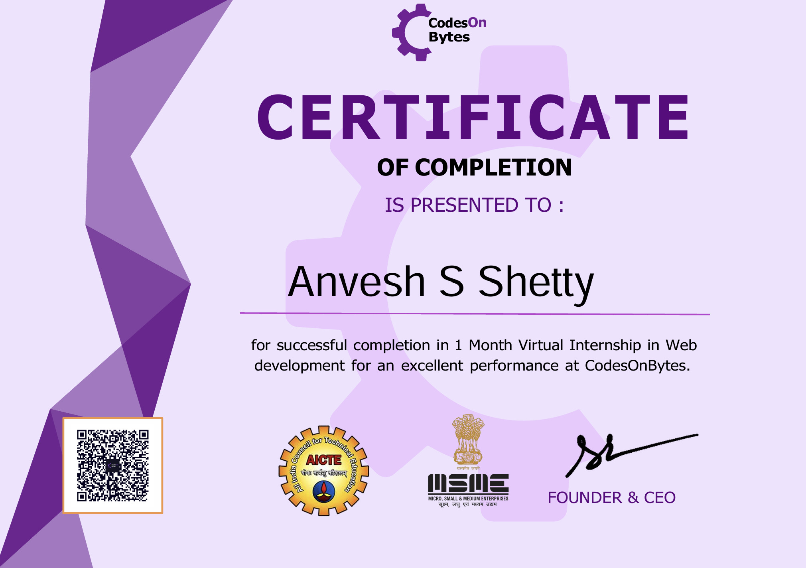

# Codes On Bytes - Web Development Internship Portfolio

Welcome to my official web development internship portfolio! This repository compiles all the tasks and applications I completed during my internship at **Codes On Bytes** (recognized by MSME & AICTE). 

---

## 📋 Internship Overview
* **Role:** Web Development Intern
* **Company:** Codes On Bytes
* **Internship Period:** October 2023 – November 2023
* **Status:** Successfully Completed

---

## 📜 Official Certificate
Below is the completion certificate issued by Codes On Bytes for fulfilling all web development project requirements:

---

## 🛠️ Global Technologies Used
* **Languages:** HTML5, CSS3, JavaScript (ES6+)
* **Design Philosophy:** Responsive Layouts, Clean UI Components, Form Validation

---

## 📂 Project Directory (Click to View Code)

### 🟣 Phase 1 Projects

* **Task 1: Registration / SignUp Form**
  * *Description:* A fully responsive user registration interface featuring clean custom CSS layouts and client-side form validation.
  * *👉 View Code Branch:* [Go to Registration Form Branch]([https://github.com](https://github.com/Anveshsshetty/Cob_Webdev/tree/registration-form))

* **Task 2: To-Do List Application**
  * *Description:* An interactive task tracker that allows users to dynamically add, mark complete, and delete daily tasks using JavaScript.
  * *👉 View Code Branch:* [Go to To-Do List Branch](https://github.com)

---

### 🟣 Phase 2 Projects

* **Task 1: Unit Converter Utility**
  * *Description:* A functional frontend calculation tool supporting real-time unit conversions across Length, Temperature, Weight, and Time.
  * *👉 View Code Branch:* [Go to Unit Converter Branch](https://github.com)

* **Task 2: E-commerce Website Landing Page**
  * *Description:* A modern, conversion-focused landing page optimized for retail products with interactive navigation elements.
  * *👉 View Code Branch:* [Go to E-Commerce Landing Page Branch](https://github.com)

---

## 🚀 How to Review These Projects

1. Click any of the **"Go to Branch"** links listed in the directory above.
2. Once on the branch, you can view the `index.html`, `style.css`, and script files directly in your browser.
3. To run a project locally, switch to that specific branch, click the green **Code** button, download the ZIP, and open `index.html` in any web browser.
